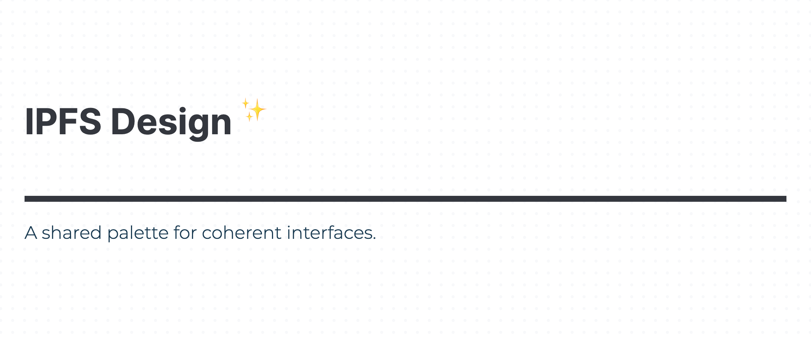

We use [tachyons] & [ipfs-css] to enable distributed creativity. By agreeing on
shared palette of colors, fonts, and scales, we can support independent groups
to experiment with new UI ideas which feel consistent, without requiring co-ordination.

Projects using this:

- [ipfs-webui](https://github.com/ipfs-shipyard/ipfs-webui)
- [ipfs-companion](https://github.com/ipfs-shipyard/ipfs-companion)
- [ipfs-desktop](https://github.com/ipfs-shipyard/ipfs-desktop)
- [ipld-explorer](https://explore.ipld.io)
- [proto.school](https://proto.school)
- [ipld.io](https://ipld.io)
- [CID inspector](https://cid.ipfs.io)
- [Filecoin Replication game leaderboard](https://github.com/filecoin-project/replication-game-leaderboard/)
- [Filecoin block explorer](https://github.com/filecoin-project/filecoin-explorer)

and this one.

## Usage

This project was bootstrapped with [Create React App](https://github.com/facebook/create-react-app).

In the project directory, you can run:

### `npm start`

Runs the app in the development mode. 
Open [http://localhost:3000](http://localhost:3000) to view it in the browser.

The page will reload if you make edits. 
You will also see any lint errors in the console.

### `npm test`

Launches the test runner in the interactive watch mode. 
See the section about [running tests](https://facebook.github.io/create-react-app/docs/running-tests) for more information.

### `npm run build`

Builds the app for production to the `build` folder. 
It correctly bundles React in production mode and optimizes the build for the best performance.

The build is minified and the filenames include the hashes. 
Your app is ready to be deployed!

See the section about [deployment](https://facebook.github.io/create-react-app/docs/deployment) for more information.

[tachyons]: http://tachyons.io/
[ipfs-css]: https://github.com/ipfs-shipyard/ipfs-css
